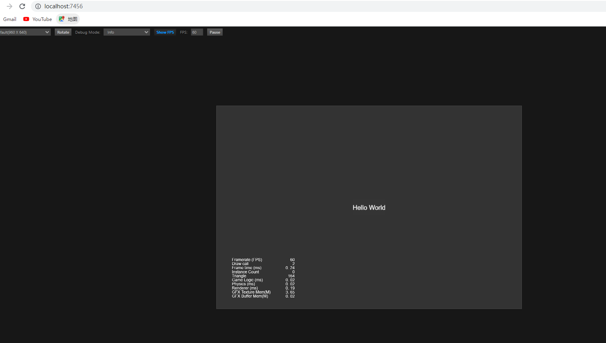
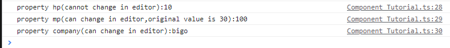
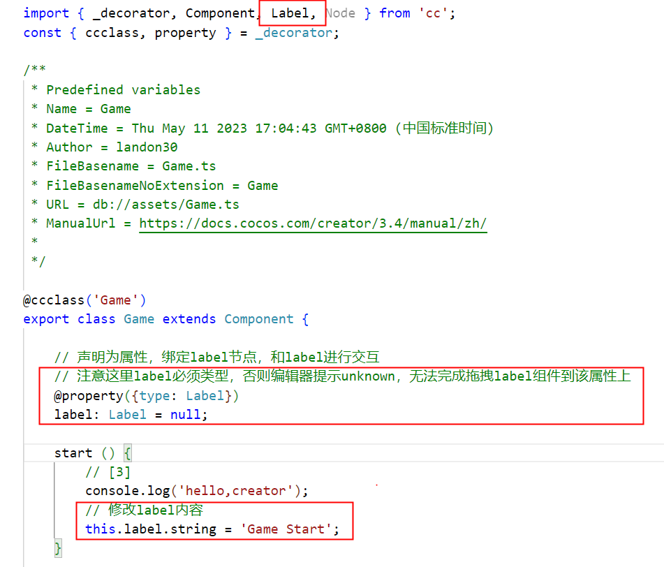
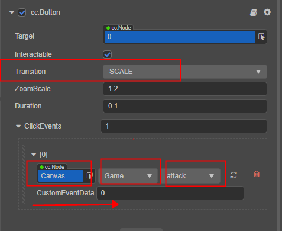

# Creator新手笔记


## 微信读书 《Cocos Creator 3.x 游戏开发入门与实战》


### chap1

1. Cocos Creator的最新版本为3.4.2
2. 文档 & 论坛
   - https://docs.cocos.com/creator/manual/zh/
     - 在查阅文档时，一定要先确认文档版本是对应当前使用的Cocos Creator版本的
   - https://forum.cocos.org/
3. 场景是将游戏内容（角色、UI、场景物体等）呈现给玩家的一个载体。它就像是歌剧表演的舞台，游戏中的任何内容都需要放到场景上才能被观众看到
   - 在场景创建成功后需要双击【Game】场景，以确保当前所处的场景是我们需要的
   - 在向场景中添加【Hello World】文本之前，还需要在场景中添加一个Canvas节点。在Cocos Creator中，文本是作为2D元素存在的，在Cocos Creator 3.x中，所有的2D元素都必须作为RenderRoot2D的子节点才能被渲染，即需要显示的2D元素只有挂载在RenderRoot2D节点上，才能被正常显示。而Canvas承自RenderRoot2D，因此我们可以把所有需要显示的2D元素都挂载在Canvas节点上，从而让引擎渲染对应的元素
   - 在层级管理器中右击并在弹出的快捷菜单中选择【创建】→【UI组件】→【Canvas（画布）】命令，即可在场景中创建一个Canvas节点
     - 在创建Canvas节点后，右击层级管理器中的【Canvas】节点，在弹出的快捷菜单中选择【创建】→【2D对象】→【Label（文本）】命令，即可在Canvas节点下创建一个文本节点
     - Label是2D组件，如果创建的是3D空项目，当添加了文本节点后，由于场景默认是3D的，所以可能并没有在场景编辑器中看到相应的文本。此时需要点击编辑器顶部工具栏中的【3D】按钮，将场景从默认的3D视图切换为2D视图，也可以使用快捷键F2来实现场景的切换
     - 在层级管理器中选中【Label】节点，可以在属性检查器中对Label的文本内容进行修改#【String】
   - 点击编辑器顶部的预览按钮，将会在浏览器中打开并预览运行【Hello World】项目
     - 


### chap2

1. 外部工具

   - Chrome浏览器也是Cocos Creator官方推荐使用的预览浏览器

   - VS Code还是Cocos Creator官方推荐使用的脚本编辑器
     - 可以将它们配置为Cocos Creator的默认外部程序

2. 脚本

   - 在Cocos Creator中，脚本也是资源的一部分。在资源管理器中创建的脚本，默认是一个NewComponent组件，称为脚本组件
   - 在通常情况下，没有被加载的游戏脚本是不会自动运行的，为了方便后续测试脚本，我们可以将其绑定到场景节点中，让其在加载节点时被触发执行。因此在脚本编写完成之后，我们还需要对脚本进行绑定操作
     - 在Cocos Creator中，脚本可以作为节点的组件存在，因此我们可以通过给节点添加组件来绑定脚本。编辑器提供了两种方式来添加组件：一种是拖动式添加，另一种是通过点击【添加组件】按钮添加。下面我们采用后者来对脚本进行绑定操作
       - landon-可以选中节点，直接将脚本拖到右侧节点的属性检查器
     - 在场景中创建一个空节点，并让其作为脚本组件的载体。右击层级管理器内的空白区域，在弹出的快捷菜单中选择【创建】→【空节点】
     - 在层级管理器中选中新建的【Node】节点，之后在属性检查器中点击【添加组件】→【自定义脚本】→【Game】按钮，即可为当前的节点绑定我们自定义的Game脚本
     - 为了让脚本能够被触发执行，我们将其绑定到了场景节点上。当加载场景时，场景下的所有子节点都会被加载；当加载到Node节点时，该节点上绑定的组件也会被同时加载，此时，Game脚本将会以组件的方式运行。因此，当我们在预览运行Game场景时，脚本中添加的调试输出语句【hello world】也将会被触发。
       - 为了测试调试输出语句，接下来我们将通过Chrome浏览器的开发者工具来查看相关的调试输出
       - 我们可以使用快捷键F12，或者点击Chrome浏览器右上角的三个点的按钮，选择【更多工具】→【开发者工具】命令
       - 在开发者工具界面中，点击【Console】选项卡切换到调试输出界面，此时我们可以看到脚本运行后打印出来的【hello world】
     - 
     - 

3. TypeScript基础

   - TypeScript是一门基于JavaScript的编程语言。它在JavaScript的基础上添加了类型系统，使得TypeScript具备了静态语言的特点。TypeScript作为JavaScript的超集存在，因此它可以完全兼容JavaScript的语法

   - 变量声明

     ```
     let hp: number = 100;
     let skill_name: string = '烈焰斩';
     let is_cd: boolean = false;
     
     let mp: any = 200;
     mp = "魔法";
     
     // 不指定变量类型
     let name = 'landon';
     let age = 34;
     
     // bigo "landon"
     s0 = 'bigo "landon"';
     // bigo 'landon'
     s1 = "bigo 'landon'";
     
     
     
     // landon 注意(和熟悉的Java语法区别)
     1. 有一个let关键字声明变量
     2. 先声明变量名字，然后是变量类型，中间有`: ` 
     3. 数字类型是number
     4. 字符串可以是单引号，也可以双引号
     5. 类型可以是any
     6. 可以不声明类型，有类型推断
     ```

   - 条件语句同Java

   - switch/case中的case可以是字符串

   - 循环同Java，不过由`for(int i = 0)` 变为 `for(let i: number = 0)`

   - 数组

     ```
     // 数组，声明方括号在后，初始化也是方括号[]，不是{}
     let jobs: string[] = ['法师', '射手', '战士', '骑士'];
     
     // for循环两种遍历
     for(let i: number = 0; i < jobs.length; i++) {
         console.log(jobs[i]);
     }
     
     // for of
     for(let job of jobs) {
         console.log(job);
     }
     ```

   - 对象

     ```
     // 对象 key-value，value的值可以是多种类型(变量、数组、对象、函数等)
     let hero = {
         hp: 20,
         mp: 30,
         job: '刺客',
         equipment: ['头盔','肩甲','靴子']
     };
     
     console.log('hero.hp=' + hero.hp);
     console.log('hero.equipment=' + hero.equipment);
     ```

   - 函数

     ```
     // 函数
     function getJobByIndex(index: number): string {
         return jobs[index];
     }
     
     console.log('function getJobByIndex call=' + getJobByIndex(2));
     ```

   - 类

     - 在资源管理器中创建的脚本，它的类名默认与脚本名保持一致
     - 有属性和方法

   - 其他

     - `dummy` '假的'

4. 脚本组件基础

   - 所有继承自Component的类都被称为组件类，其对象被称为组件。我们可以将组件挂载到场景中的节点上，用于控制节点的行为。需要注意的是，如果没有使用＠ccclass将组件类声明成cc类，则无法将组件添加到节点上
   - 将装饰器ccclass应用在类上时，此类称为cc类。cc类注入了额外的信息以控制Cocos Creator编辑器对该类的序列化和场景编辑器对该类的展示等。因此，未声明ccclass的组件类无法作为组件被添加到节点上
     - 装饰器ccclass的参数name指定了cc类的名称，cc类名是独一无二的，这意味着同类名在不同目录下也是不被允许的。当需要获取相应的cc类时，可以通过cc类名来查找
   - 属性装饰器property可以被应用在cc类的属性或访问器上，并用于控制Cocos Creator编辑器中cc类属性的序列化，以及该属性在属性检查器上的显示等
     - 这里需要注意的是，属性装饰器property的选项type会指定属性的cc类，若未指定，则Cocos Creator将从属性的默认值中推导其类型
     - 以普通方式声明的属性不能在编辑器中被访问，只有使用了属性装饰器property修饰的属性才能在编辑器中被访问（也可以在编辑器修改）
     - 
     - 
     - 

5. 与其他节点及组件交互

   - 假设现在有一个需求，需要将Label节点的string属性进行动态调整，使默认的【Hello World】文本在游戏运行后变为【Game Start】。此时我们就需要让Game脚本与Label节点进行交互
   - 我们定义了label变量并将其默认值设置为null，同时将它的type声明为Label组件。这里需要注意的是，为了能在脚本中正常使用Label类，还需要在脚本的头部对该类进行导入（将Label作为脚本的一个属性）
     - 通常情况下，使用VS Code编写代码时，编辑器会对代码进行实时检测，当发现我们使用了未导入的内置组件类时，该类将会被VS Code编辑器自动导入。如果编辑器未能正确检测到类的引用，那么也可以手动将用到的类进行导入
     - 我们还需要在属性检查器中将Label节点与Game脚本进行绑定，否则在预览运行时会报错。回到Cocos Creator编辑器，将层级管理器中的Label节点拖动到Game脚本组件中的Label属性上，从而完成对组件的绑定
     - 完成拖动绑定后预览运行，浏览器中显示的文字将会从【Hello World】变成【Game Start】
       - 选中node，将Label拖到右侧属性检查器Game脚本的label上
       - 
       - 
       - 
     - 注意：
       - // 注意这里label必须类型，否则编辑器提示unknown，无法完成拖拽label组件到该属性上

6. 脚本的生命周期

   - 脚本中指的就是从创建到销毁的整个过程
   - 脚本组件的生命周期回调函数包括：onLoad、onEnable、start、update、lateUpdate、onDisable、onDestroy
   - onLoad回调函数会在脚本组件的初始化阶段被调用，比如所在的场景被载入或者所在的节点被激活。在onLoad阶段，可以获取场景中的其他节点，以及与节点关联的资源数据。onLoad总会在调用start方法前被执行，可以用于设置脚本的初始化顺序。通常我们会在onLoad阶段做一些与初始化相关的操作
   -  当组件的enabled属性从false变为true时，或者所在节点的active属性从false变为true时，都会激活onEnable回调函数。如果节点第一次被创建且enabled属性为true，则会在onLoad之后、start之前调用onEnable回调函数
   - start回调函数会在第一次激活组件之前，也就是第一次执行update之前被触发。start通常用于初始化一些中间状态的数据，这些数据可能会在update时发生改变，并且被频繁地进行enable和disable操作
   - update回调函数会在游戏每一帧渲染之前被触发。游戏开发的一个关键点是在每一帧渲染前更新物体的行为、状态和方位。这些更新操作通常都被放在update回调函数中
   - lateUpdate回调函数会在游戏每一帧渲染之后被触发。update会在所有的动画更新之前被执行，但如果我们要在动效（如动画、粒子、物理等）更新之后进行额外的操作，或者希望在执行完成所有组件的update之后进行其他操作，就需要用到lateUpdate回调函数
   - 当组件的enabled属性从true变为false时，或者所在节点的active属性从true变为false时，会激活onDisable回调函数
   - 当组件或者所在节点调用了destroy函数时，回调函数onDestroy也会被调用，并在当前帧结束时统一回收组件


### chap3

1. 游戏

   - 类似“石头剪刀布”的克制游戏

2. 在通常情况下，为了能更好地管理游戏中要用到的资源文件，会在项目创建之初进行目录结构的规划，并通过创建文件夹对不同类型的资源进行分类

   -  scenes、scripts、sources。其中scenes文件夹用于存放场景资源，scripts文件夹用于存放脚本资源，sources文件夹用于存放游戏中需要用到的图片和粒子资源
   - 将素材拖到sources下(导入项目)
     - 5张图片：弓箭、流星锤、盾牌、敌人、重启

3. 使用图片资源

   - 在Cocos Creator中，不涉及模型的图片渲染体统称为2D渲染对象。与3D对象不同，2D对象本身不具有model信息，其顶点信息是由UITransform组件的Rect信息持有并由引擎创建的，且本身没有厚度。根据引擎的设计要求，2D渲染对象需要作为RenderRoot节点（带有RenderRoot2D/Canvas组件的节点）的子节点才能完成数据的收集操作。即2D对象的渲染要求有以下两点。
     - 自身带有UITransform组件
     - 需要作为带有RenderRoot2D/Canvas组件的节点的子节点
   - 在Cocos Creator中，如果需要显示一张图片，则可以向场景中添加一个带有Sprite组件的节点，并将想要使用的图片资源绑定到Sprite组件上
     - 由于Sprite组件是2D渲染组件，因此添加了Sprite组件的节点也必须作为RenderRoot节点的子节点存在。在向场景中添加图片资源之前，我们还需要创建一个内置的Canvas对象
     - 创建完成后可以在场景编辑器中看到白色的高亮边框，这就是画布的显示区域
     - 将【enemy】图片资源从资源管理器中拖动到层级管理器的【Canvas】节点下
       - 这种方式可以为我们在场景中自动创建与图片资源同名的节点，同时创建的节点会被自动添加上Sprite组件，并为组件绑定对应的图片资源
     - ctrl + s，保存，将场景命名并保存到scenes下
   - Sprite是2D/3D游戏中最常见的显示图像的方式。通过在节点上添加Sprite组件，可以在场景中显示项目资源中的图片
     - 通过观察属性检查器中的【enemy】节点可以发现，Cocos Creator在创建该节点时，为其Sprite组件下的【SpriteFrame】属性默认绑定了【enemy】的图片资源
   - 在属性检查器中，我们还可以看到【enemy】节点上被自动添加了另一个组件，即UITransform组件
     - UITransform组件简称为UI变换组件，它定义了UI上的矩形信息，包括矩形的内容尺寸和锚点位置。一般用于渲染、计算点击事件、调整界面布局及屏幕适配等。我们可以通过UI变换组件对图片的大小、位置进行修改
     - 在通常情况下，我们可以通过修改UI变换组件的参数调整2D对象的大小

4. 完善场景布局

   - 在通常情况下，为了方便场景的搭建工作，在开发游戏之前会选择一个合适的分辨率来作为蓝本，并以此为基础进行整体界面的搭建，而作为蓝本的分辨率也被称为设计分辨率。在本章中，我们将采用比较主流的1280px×720px分辨率
     - 不难发现预览运行时展示的内容区域与编辑器中的Canvas区域是一致的
     - 当我们尝试在层级管理器中选中【Canvas】节点时，会发现节点下的UI变换组件的【ContentSize】有一个“锁”图标，输入框也是灰色的，因此我们并不能直接对该属性进行修
     - 项目-项目设置-项目数据：设计宽度，设计高度
       - 默认是960/640，改为720/1280
     - 此时游戏的设计分辨率已经产生了变化，当我们再次预览运行时，由于游戏区域超出了浏览器的显示范围，浏览器可能会有显示不全并且出现滚动条的情况 
       - 此时可以通过Chrome预览窗口左上角的下拉菜单调整预览分辨率，根据实际需求选择一个合适的分辨率即可。在该项目中我们可以选择iPhone 8标准的预览分辨率选项
       - 
   - 在搭建游戏场景的过程中，经常会有对节点进行移动、旋转、缩放等操作的需求，这个时候我们可以通过主窗口左上角工具栏的变换工具来操作场景中的相关节点。工具栏中从左往右依次为移动变换工具、旋转变换工具、缩放变换工具、矩形变换工具、变换吸附设置
     - 移动变换工具被激活后，我们可以通过移动鼠标将【enemy】节点拖动到游戏场景的上方。如果仔细观察将会发现，在移动的过程中，【enemy】节点上的【Position】属性也会随之变化，这说明移动变换工具会在我们操作时动态地修改节点坐标的位置
     - 依次将三个技能图标及重新开始图标拖动到游戏场景中，之后使用同样的方式操作移动变换工具，将图标调整到合适的位置
   - 在通常情况下，场景中的节点会以树状结构呈现。每个节点都可以有多个子节点，而子节点的更新依赖于父节点，当父节点进行变换时子节点会随之变换。我们可以利用这个特性间接地批量调整子节点的位置
     - 首先在【Canvas】节点下新建一个空节点并命名为【enemy_skill】，然后在【enemy_skill】下依次添加三个技能的图片作为其子节点，最后只需要使用移动变换工具操作【enemy_skill】节点，即可完成所有技能图标的整体移动
     - 我们已经向enemy_skill中添加了三个节点，由于它们的坐标默认重叠在了一起，因此我们只能看到一个图标，但是为什么看到的是最后一个添加的盾牌图标呢？
       - 这是因为在Cocos Creator中，UI节点的渲染和遮挡关系会受到节点树的影响，从而按照层级管理器中节点的排列顺序从上到下依次渲染，也就是说在列表上面的节点在场景显示中会被在列表下面的节点遮盖住。我们向enemy_skill中添加了三个节点，由于默认状态下它们的坐标是一致的，且盾牌图标的节点处于最下方，因此我们只看到了盾牌图标
       - 现在可以尝试修改enemy_skill子节点的顺序来观察遮挡关系的变化。例如，可以将代表盾牌的2号节点移动到流星锤的上方(注意拖动方式)，由于节点的排列顺序发生了变化，因而遮挡关系也会随之改变，可以看到此时流星锤图标已经显示了出来
     - 为了能够向玩家反馈游戏结果，还需要在游戏中添加提示文本信息。这里我们可以使用Label组件，右击【Canvas】节点，在弹出的快捷菜单中选择【创建】→【2D对象】→【Label（文本）】命令，创建一个Label组件

5. 实现游戏核心逻辑

   - 在游戏开始后，敌人的招式图片会随机变化。为了实现这一效果，我们可以每隔一段时间随机地显示三个招式的任意一个，并隐藏其余两个，从而实现招式不停变化的效果

     - 如果想要每隔一段时间触发一些行为，则可以使用计时器函数来实现。我们可以通过计时器在固定的时间间隔重复执行某个行为，只需要在计时器的回调中将enemy_skill子节点进行随机显示与隐藏即可
     - 在资源管理器的scripts文件夹下创建Game脚本，然后将脚本挂载到Canvas节点
       - start启动定时器，随机攻击类型
       - 通过enemy_skill节点获取下面的三个子节点（图片的名字就是0/1/2），判断攻击类型和哪个子节点的名字一致，就active对应的子节点
     - 脚本编写完成后，在属性检查器中将enemy_skill节点绑定到脚本上，之后预览运行，此时敌人的招式图标已经可以随机变化了

   - 现在敌人已经可以进行随机出招了，接下来就需要为游戏添加相应的点击交互效果了。在游戏中，我们希望在玩家点击三个技能中的任意一个后，由系统选定该招式为我方出招，同时使用选定的招式与敌人当前的招式进行比拼

     - 在游戏中，我们希望在玩家点击三个技能中的任意一个后，由系统选定该招式为我方出招，同时使用选定的招式与敌人当前的招式进行比拼

     - 为了实现这一效果，我们需要在玩家点击任意一个招式时，触发事先编写的逻辑代码。在通常情况下，我们可以通过Button组件来实现这种交互效果。同时，为了给Button添加相应的响应函数事件

       - 先在脚本中添加一个按钮响应事件

         ```
         attack(event, customEventData)
         // 注意，这个是没有类型的
         // 注意，第2个参数是和下面的图的CustomEventData一致
         
         attack button click.event.target.name:0
         attack button click.customEventData:0
         
         restart button click.event.target.name:restart
         restart button click.customEventData:undefined
         
         // 获取按钮点击回调函数的参数event，event.target为点击图片的节点名字
         // 判断名字和enemyAttackType的胜负判断关系，label显示文字
         
         // 需要将label拖拽过去，和属性绑定
         
         Transition是按钮状态变化的过渡类型，鼠标放到字段上面会有提示，就是按下按钮后有一个状态，NONE的没任何变化，即看不出是按钮，虽然响应了点击事件
         ```

       - 选中玩家的招式图片，属性检查器中增加Button组件，展开ClickEvents

         - 
         - 即按钮的点击事件有4个属性，即选择哪个节点下的哪个脚本下哪个回调函数，CustomEventData是传入参数

   - 现在我们的游戏已经可以玩起来了，不过每次结束比拼后就不可以继续进行游戏了，因此需要为游戏的【重新开始】按钮实现对应的逻辑功能。可以直接使用loadScene函数对Game场景进行加载，实现“重新开局”的效果

     ```
     // 重启 按钮 点击的回调函数，可以原型为空
         // customEventData如果不在button指定，则输出undefined
         restart(event, customEventData) {
             console.log('restart button click.event.target.name:' + event.target.name);
             console.log('restart button click.customEventData:' + customEventData);
             // 重新加载场景
             director.loadScene('Game');
         }
     ```


### chap4

1. 游戏规则
   - 每局游戏开始后生成一个左右移动的敌人及一枚可以发射的子弹
   - 点击屏幕时子弹会向上方发射
   - 子弹撞击到顶部尖刺时会被销毁，同时游戏失败
   - 子弹击中敌人时，敌人与子弹会同时被销毁，玩家获得1分，此后重新生成新的敌人与子弹，游戏继续

2. 常规操作
   - 新建2D
   - 目录组织-scenes/scripts/sources
     - 导入资源(boom.plist/bullet.png/enemy.png/spike.png)
   - 调整分辨率 720 * 1280
   - 新建Canvas保存场景到scenes下并命名为Game

3. 搭建场景
   - 背景图：右键Canvas->创建2D对象->SpriteSplash(单色)，设置Color/ContentSize，bg
   - 添加子弹与敌人：拖拽bullet和enemy到bg节点下，设置Color/ContentSize/position
   - 添加尖刺元素
     - 我们需要在场景中添加多个尖刺节点，为了便于管理这些尖刺节点，可以先在bg节点下创建一个空节点top_spikes，并将其用于存放顶部的spike节点。待top_spikes创建完成后，从资源管理器中将spike图片资源拖动到top_spikes节点下，从而生成第一个尖刺节点。之后我们需要以第一个尖刺节点为副本，再复制4个尖刺节点。可以通过选中【spike】节点，使用组合键“Ctrl+D”进行复制，也可以通过右击【spike】节点，在弹出的快捷菜单中选择【生成副本】命令进行复制。为了便于管理尖刺的位置，我们将直接调整父节点top_spikes的纵坐标，从而控制整体尖刺组的纵向位置
       - 注意-现在top_spikes的坐标是(0,590)，而子下面子节点的坐标其实是相对父节点坐标的，所以看到子节点的y都是0
     - todo 这里原文应该有一些错误，上面的的尖刺y坐标都是一致的
       - 原始的spike是200*100的，但是分辨率宽度是720，所以需要4个即可（ContentSize调整为180/90）
       - 上面的4个尖刺坐标分别是(-270,0),(-90,0),(90,0),(270,0)
     - 通过复制的方式快速生成下方尖刺组了，复制一份top_spikes节点，将名字修改为bottom_spikes，并将尖刺移动到底部
       - 
       - 默认复制的尖刺也是朝下方的
       - 修改bottom_spikes节点#Scale#Y=-1，即实现了下方尖刺向上
         - todo 可以用bullet节点进行测试，效果和旋转z = 180，效果一样
     - shift全选节点，批量修改颜色
     - 

4. 触摸事件的响应

   - 游戏中，玩家点击屏幕后会发射子弹，当子弹撞击到敌人时即可获得相应的分数。由于这个功能需要使用触摸事件

   - 在Cocos Creator中，事件是游戏中触发特定行为时发出的消息，例如用户产生的输入行为：键盘、鼠标、触摸等，都会以事件的形式发送到程序。在代码中，我们可以监听对应的事件消息，并在事件发生时调用函数

   - 事件系统是Cocos Creator内置的委派机制，它允许事件监听者对事件发送者发出的消息进行响应，且无须相互引用。通过使用事件系统，可以降低代码的耦合度，使代码更加地灵活

   - 监听和发射事件

     - Cocos Creator引擎提供了EventTarget类，用以实现事件的相关功能。引擎内部的事件监听与发射系统都是基于该类实现的，例如提供全局输入事件系统的input对象，以及Node上的事件监听系统

     - 我们也可以通过使用该类来实现自定义事件的监听和发射

       - on/off  注册/取消监听

       - emit   发射事件

       - 测试代码

         ```
         // EventTest.ts
         
         // 注意EventTarget是cc的，不是ts默认的
         import { _decorator, Component, EventTarget, Node } from 'cc';
         // 注意const定义在类的外面
         const eventTarget = new EventTarget();
         
         @ccclass('EventTest')
         export class EventTest extends Component {
             private user_exp = 0;
         
             protected onLoad(): void {
                 // 监听事件
                 eventTarget.on('incr_exp', (exp) => {
                     this.user_exp += exp;
                     console.log('获得了' + exp +  ' 点经验，当前经验值： ' + this.user_exp)
                 });
             }
         
             start () {
                 // 发射事件
                 eventTarget.emit('incr_exp',10);
         
         		// 每1s发射一次
                 setInterval(() => {
                     eventTarget.emit('incr_exp',1);
                 },1000);
             }
         
         // 输出
         Cocos Creator v3.4.2
         EventTest.ts:26 获得了10 点经验，当前经验值： 10
         EventTest.ts:26 获得了1 点经验，当前经验值： 11
         EventTest.ts:26 获得了1 点经验，当前经验值： 12
         EventTest.ts:26 获得了1 点经验，当前经验值： 13
         EventTest.ts:26 获得了1 点经验，当前经验值： 14
         ...
         
         
          // 输入事件系统input测试
         input.on(Input.EventType.TOUCH_START,(event) => {
             console.log('TOUCH_START');
         },this);
         
         input.on(Input.EventType.TOUCH_MOVE,(event) => {
             console.log('TOUCH_MOVE');
         },this);
         
         input.on(Input.EventType.TOUCH_END,(event) => {
             console.log('TOUCH_END');
         },this);
         
         // todo 这个TOUCH_CANCEL无法通过鼠标模拟，不知道如何触发
         input.on(Input.EventType.TOUCH_CANCEL,(event) => {
             console.log('TOUCH_CANCEL');
         },this);
         ```

     - 在Cocos Creator 3.4.0中，input对象实现了EventTarget的事件监听接口，通过input对象可以直接监听全局的系统输入事件。全局输入事件是指与节点树不相关的各种输入事件，由input统一派发，目前支持的事件有：鼠标事件、触摸事件、键盘事件、设备重力传感事件。所有的全局输入事件都可以通过接口input.on(type, callback, target)注册

       - 选择触摸事件，则可同时响应移动端的触摸事件和PC端的鼠标点击事件，因此我们选择使用触摸事件
       - 根据游戏的需求，当玩家点击屏幕时，需要响应TOUCH_START事件并发射子弹
       - 由于在组件被销毁后就不再需要对游戏进行触摸监听，所以在onDestroy回调时，我们使用off方法对触摸事件的监听进行关闭。而off方法的参数必须和on方法的参数一一对应，才能完成关闭，因此我们不再使用匿名函数作为事件函数，而是将其声明为fire函数，这样可以更方便地在组件被销毁时对监听事件进行解绑

5. 使用缓动系统

   - 通过使用缓动系统来让游戏“动起来”

   - 缓动系统(Tween)可以对目标对象的任意属性进行缓动。缓动系统可以让我们轻松地实现对象的位移、缩放、旋转等各种动作。得益于其方便的API接口，在实际项目中，缓动系统常被用于简单形变和位移动画的制作
     - 在这个小游戏中，我们可以使用缓动系统来制作子弹的位移动画，让子弹从初始位置向上移动到游戏场景外，从而实现子弹发射的效果
     
     - 子弹的发射行为本身就是一个位移行为，而通过缓动系统中的to接口，可以让bullet节点在固定时间内移动到指定的坐标。因此，我们只要在to接口中给bullet节点设置一个屏幕上方的坐标，即可实现子弹的位移，从而模拟出子弹发射的效果
     
       ```
       // 使用tween实现子弹位移
       // 0.6s移动到目标位置
       tween(this.bulletNode).to(0.6,{position: new Vec3(0,600,0)}).start();
       ```
     
     - 预览运行，当我们在游戏中点击时，下方的子弹就可以成功地发射出去了。不过此时代码的逻辑还存在一点问题，当我们尝试在游戏中疯狂地点击屏幕时，会发现子弹的速度越来越慢，这是因为在每次点击的时候都重复执行了一次子弹发射的缓动动画。由于缓动动画的起点在每次点击的时候都离终点越来越近，而缓动动画的持续时间不变，因此子弹在单位时间内移动的速度越来越慢
       - 根据游戏规则，在子弹发射出去后，就不可以对子弹进行重复操作了

6. 实现击中判定

   - 并不打算额外引入复杂的物理系统，而是通过编写逻辑判断的代码来实现子弹与敌人的碰撞。这里我们会采取一个比较简单的方式，在update回调函数中对子弹及敌人的坐标进行比对，当两个对象的中心点坐标的距离小于或等于某个值时，即两个对象足够接近，我们则可以认为子弹与敌人发生了碰撞

   - // landon-相当于update每帧检测是否碰撞

     ```
     update (deltaTime: number) {
             // 每帧检测碰撞
             this.checkHit();
         }
     
     // 子弹和敌人的碰撞检测
     checkHit() {
         if(this.gameState != 1) {
             return;
         }
     
         let distance = Vec3.distance(this.bulletNode.position,this.enemyNode.position);
     
         if(distance <= 50) {
             // 关闭tween动画
             this.bulletTween.stop();
             // 游戏结束
             this.gameState = 2;
     
             // 隐藏两个节点对象
             this.enemyNode.active = false;
             this.bulletNode.active = false;
         }
      }
     ```

7. 让敌人动起来

   - todo 编码风格还是用熟悉的Java

   - todo ts代码变化后，有时候刷新浏览器即可，有时候需要重新运行预览

   - 看书中的源码做了修改

     - 监听事件变为了 `this.node.on()`
     - enemyInit放到了start方法，而不是onLoad方法(onLoad也可以)

   - 使用缓动系统来实现敌人左右移动的动画

     ```
     // 敌人初始化位置，最右侧
     let st = new Vec3(300,260,0);
     // 右-左的时间
     let dua = 1.5;
     
     this.enemyNode.setPosition(st);
     this.enemyNode.active = true;
     
     this.enemyTween = tween(this.enemyNode)
     // 最左侧位置
     .to(dua,{position: new Vec3(-st.x,st.y,0)})
     // 最右侧位置
     .to(dua,{position: new Vec3(st.x,st.y,0)})
     // 打包
     .union()
     // 重复执行
     .repeatForever()
     // 启动
     .start();
     ```

8. 实现死亡判定

   - 没有命中敌人时，就必须要刷新浏览器才能重新开始游戏，这样的体验并不是很好。所以，我们接下来将为游戏继续添加死亡判定逻辑，让游戏结束后可以自动重新开始

   - 游戏的死亡判定实现起来非常简单，我们可以为子弹发射的缓动动作添加一个回调函数，当回调函数被调用时，则说明子弹成功地到达了目的地，并且没有与敌人发生碰撞

   - bullet tween回调报错

     ```
     Game Over!
     index.js:1 ErrorEvent
     (anonymous) @ index.js:1
     Game.ts:87 Uncaught TypeError: Cannot set properties of null (setting 'gameState')
         at gameOver (Game.ts:87:9)
         at CallFunc.execute (action-instant.ts:290:28)
         at CallFunc.update (action-instant.ts:295:14)
         at Sequence.update (action-interval.ts:421:21)
         at Sequence.step (action-interval.ts:159:14)
         at ActionManager.update (action-manager.ts:479:49)
         at TweenSystem.update (tween-system.ts:80:28)
         at Director.tick (director.ts:697:38)
         at callback (game.ts:802:26)
         
     // 源码
     this.bulletTween = tween(this.bulletNode)
         .to(0.6,{position: new Vec3(0,600,0)})
         .call(this.gameOver)
         .start();
     
     // 当子弹动画顺利到达目标为止，说明没有命中，游戏结束
     gameOver() {
         console.log('Game Over!');
         this.gameState = 2;
         Director.instance.loadScene('Game');
     }
     
     // debug
     // cocos creator#vs工作流#添加chrome debug配置
     
     ErrorEvent {isTrusted: true, message: 'Uncaught TypeError: Cannot set properties of null (setting 'gameState')', filename: 'http://localhost:7456/scripting/x/mods/fs/0/assets/scripts/Game.js', lineno: 112, colno: 26, …}
     index.js:1
     Uncaught TypeError TypeError: Cannot set properties of null (setting 'gameState')
         at gameOver (c:\gitee\creator-newbie\newbie-book-003\assets\scripts\Game.ts:87:9)
         at execute (c:\gitee\creator-newbie\newbie-book-003\scripting\engine\cocos\tween\actions\action-instant.ts:290:28)
         at update (c:\gitee\creator-newbie\newbie-book-003\scripting\engine\cocos\tween\actions\action-instant.ts:295:14)
         
     // todo 难道tween的callback中无法拿到private属性？
     
     // fixed
     
     // 传入回调函数的写法
     .call(() => {
         this.gameOver();
     })
     // 而不是
     .call(this.gameOver)
     ```

9. 完善得分逻辑

   - 不过当前的游戏逻辑还不是很完善，当击中敌人后游戏也就结束了，并不能让玩家持续地玩下去。我们希望在子弹击中敌人后，可以刷新出新的敌人，并且分配一枚新的子弹，同时获得相应的得分，让游戏实现“无尽模式”

   - 即碰撞后，增加得分，敌人和子弹等重新初始化

     - 增加label节点，和脚本属性绑定

     - 可以设置LineHeight（字体高度）

     - 实现bulletInit和incrScore

       ```
       // 子弹初始化
       bulletInit() {
           // 子弹初始位置
           let st = new Vec3(0,-340,0);
       
           this.bulletNode.setPosition(st);
           this.bulletNode.active = true;
       }
       
       // 子弹和敌人的碰撞检测
       checkHit() {
       	if(distance <= 50) {
       		...
       		this.incrScore();
               this.newLevel();
             
        // 当和敌人碰撞后，增加得分，并重新初始化
        newLevel() {
           this.bulletInit();
           this.enemyInit();
       
           this.gameState = 0;
        }
        
       incrScore() {
               this.score += 1;
               this.scoreLabel.string = String(this.score);
        }
       ```

   - todo 目前碰撞后

     - 明显感觉敌人的tween动画卡了一下，可能是因为碰撞的时候，tween动画还在播放
       - // 加一个判断，碰撞后敌人初始化，如果enemyTween不为null，则直接this.enemyTween.stop() todo 需要实际测试效果

   - 此时的游戏已经可以实现“无尽模式”了。每次击中敌人后，游戏会再次刷新出新的敌人，并为玩家重新分配一枚子弹，同时得分也会进行相应的变化

10. 随机化敌人的初始状态

   - 前我们已经完成了游戏的得分逻辑，在击中敌人后已经可以获得分数，并且也会刷新出新的敌人。不过多玩几次就会发现，此时的游戏每次刷新出来的敌人的位置和速度都是固定的，很容易找到规律，游戏的挑战性并不是特别强
   - 对代码进行微调，为敌人的初始化状态添加一定的随机元素，我们可以在合理的范围内，随机给出敌人出现的位置以及其移动的速度，以此让游戏变得更加有趣味性
     - y坐标随机
     - tween的缓动时间也随机
     - x随机到最左侧或者最右侧
   - 也许你还是对当前游戏的数值不怎么满意，这种情况在游戏开发的过程中是十分常见的，因为游戏的数值需要花费很多时间进行测试。而代码所用到的区间数值仅用于演示，后续可以根据自己的实际需求去调整游戏的难度，慢慢调整和优化游戏的参数
   - todo 脚本中的初始坐标等都可以在编辑器下调整得到

11. 2d粒子

    - 右击【bg】节点，在弹出的快捷菜单中选择【创建】→【2D对象】→【ParticleSystem2D（粒子）】命令，为游戏创建一个默认的2D粒子

      - 属性检查器，有一个PlayOnLoad，取消勾选，否则会直接在游戏内显示

    - 2D粒子组件(ParticleSystem2D)用于读取粒子资源数据，并对其进行一系列操作，例如播放、暂停、销毁等

    - 脚本绑定bloom节点

      - 和敌人碰撞以及游戏结束的时候播放粒子效果

      - 实现一个播放函数

        ```
        // 播放例子效果  位置和颜色
         boom(pos,color) {
            this.boomNode.setPosition(pos);
            // 组件获取方法  getComponent
            let particle = this.boomNode.getComponent(ParticleSystem2D);
        
        	// 注意-样例代码错误
        	// 粒子颜色（和敌人碰撞是敌人的颜色，和尖刺碰撞是子弹的颜色）
            if(color != undefined) {
                particle.startColor = particle.endColor = color;
            }
        
            particle.resetSystem();
         }
        ```

    - todo 实际游戏运行时，和敌人碰撞后，粒子一直在？ todo 后续看看粒子系统细节

    - 可使用例子提供的boom.plist替换，试一下效果

      - 会散开消失


### chap5

1. 游戏简介

   - 游戏开始之后，玩家将会控制一个跳跃前进的小球，通过操作小球不断弹跳向下一块跳板来获取更多的分数，倘若不慎落入深渊则会导致游戏失败。游戏的操作方式非常简单，玩家需要在合适的时机点击屏幕，让小球在加速下落后弹起，并利用小球弹跳后产生的滞空时间来调整下一个落点，当跳到下一块跳板时即可获得一分，而当落入深渊时游戏则直接结束

2. 创建项目

   - 2d项目 - 设置分辨率
   - 导入资源（ball.png、grids.png）
   - 创建canvas -> bg -> 保存场景为Game

3. 2D物理系统

   - 目前2D物理系统默认是box2d（项目设置#功能裁剪）

     - 本章的游戏除了碰撞检测外，还需要用到物理模块实现弹跳效果

   - 2D刚体组件

     - ball图片拖拽到bg下，添加Physics2D#RigidBody2D（2D刚体）组件
       - 运行游戏，小球掉落
     - 创建一个单色对象block表示挡板/跳板
       - 添加Physics2D#RigidBody2D组件
       - 设置type为Static，即不受重力影响
       - 运行游戏
         - 小球掉落，穿过挡板

   - 使用2D碰撞组件

     - 视觉上看到的小球与跳板仅仅是“图像”部分，而物理世界在进行碰撞计算时，视觉图像的部分是不参与的，真正参与的只有碰撞组件上的碰撞区域，即物理世界只能“看到”碰撞区域上绘制的“图像”。因此，为了让物理引擎正确地计算碰撞行为，我们还需要为小球和跳板添加碰撞组件

     - 在Cocos Creator中，2D物理对象可以添加一个或多个碰撞组件，每个碰撞组件都会包含一个碰撞区域，这些碰撞区域定义了对象的碰撞边界。通过这些区域可以检测对象之间是否发生了接触。也正是这些碰撞区域让物理引擎“看到”了刚体。

     - ball节点添加Physics2D#Colliders#CircleCollider2D，添加圆形碰撞区域

     - block节点添加Physics2D#Colliders#BoxCollider2D，添加矩形碰撞区域

     - 为了让小球在下落后可以弹回初始位置，我们将其碰撞组件上的弹性系数调整为1。弹性系数Restitution为1时表示小球将会与跳板产生弹性碰撞，即碰撞前后整个系统的动能不变，小球下落后也可以弹回初始位置。如果弹性系数Restitution为默认值0，则表示碰撞为完全非弹性碰撞，当小球撞击到跳板时则会直接静止，而不会产生弹跳行为

       - 运行游戏，会看到一个不停跳跃的小球。如果你想让小球下落的速度变快，可以直接调整小球的重力缩放值【GravityScale】，以增强其受重力影响的效果。这里我们可以将该值修改为【4】，让小球受到的重力变为原先的四倍，从而让下落速度变快

     - 绘制物理调试信息

       - 玩家在玩游戏时并不需要看到调试碰撞区域，而作为开发者，如果可以在开发模式下看到碰撞区域，则可以更方便地进行调试

       - 由于物理系统默认并不会绘制任何的调试信息，因此我们可以通过在脚本中修改debugDrawFlags的参数的方式来打开调试功能

         ```
         start () {
                 this.showDebug();
             }
         
         // 勾选Canvas#Settings脚本的isDebug
         // 运行游戏会发现碰撞区域以及颜色标识
         showDebug() {
             if (this.isDebug) {
                 // 绘制碰撞的物理区域
                 PhysicsSystem2D.instance.debugDrawFlags = 
                 EPhysics2DDrawFlags.Aabb | 
                 EPhysics2DDrawFlags.Pair |
                 EPhysics2DDrawFlags.CenterOfMass |
                 EPhysics2DDrawFlags.Joint |
                 EPhysics2DDrawFlags.Shape;
             } else  {
                 // 关闭调试区域
                 PhysicsSystem2D.instance.debugDrawFlags = EPhysics2DDrawFlags.None;
             }
         }
         ```

4. 实现小球操控逻辑

   - 添加Game脚本，监听触摸事件

     - 回调修改刚体移动速度

       ```
       // 获取小球节点，获取2d刚体组件，修改瞬时速度
       let rigidBody = this.ballNode.getComponent(RigidBody2D);
       // 修改刚体移动速度
       rigidBody.linearVelocity = new Vec2(0,-50);
       ```

     - 运行游戏，触摸后，小球加速小落，但是反弹的高度也更高了

   -  碰撞回调

     - 希望它即使进行了加速下落，也应该回到初始的高度。为了修正这个问题，我们可以在小球初次下落撞击到跳板时，记录其瞬时速度，此后不管小球以任何速度撞击到跳板，我们都将它的瞬时反弹速度修正为初次记录的速度，以便让其能够返回到正确的高度

     - 添加一个碰撞回调（注意勾选ball节点#刚体组件#EnabledContactListener属性，否则不会触发碰撞回调）

       ```
       onCollisionHandler() {
           let rigidBody = this.ballNode.getComponent(RigidBody2D);
           let collider = this.ballNode.getComponent(Collider2D);
       
           collider.on(Contact2DType.BEGIN_CONTACT, () => {
               if(this.bounceSpeed == 0) {
                   // 记录第一次下落的瞬时速度
                   this.bounceSpeed = Math.abs(rigidBody.linearVelocity.y);
               } else {
                   // 再次反弹时，用记录的速度，保证回弹同样的高度
                   rigidBody.linearVelocity = new Vec2(0,this.bounceSpeed);
               }
           },this);
       }
       ```

     - 运行游戏，此时的效果，是一个小球，触摸后可以加速下弹，反弹后还是原来的高度

5. 实现游戏核心逻辑

   - 预制体

     - 根据游戏规则，游戏开始后场景会向玩家提供多块可以踩踏的跳板，为了实现这一需求，我们可以在编辑场景时，通过复制的方式向场景中添加多块跳板。不过，采用这种方式添加的跳板会存在一个问题，即添加的跳板数量是有限的，当玩家控制小球前进足够远的距离后，将会出现跳板用完的情况。所以，我们希望在游戏运行的过程中，当发现跳板用完时，可以动态地添加。而想要动态地添加跳板，就需要一个新的概念“预制体
     - 预制体(Prefab)是用于存储可复用场景对象的序列化文件，它可以包含节点、组件及组件上的数据。通俗地说，我们可以将预制体理解为专门用于复制的模板文件。这读起来似乎有些拗口，回想一下，我们在搭建场景的过程中，在复制某个对象前需要先制作一个可以用于复制的“原件”，之后才能在编辑器中基于“原件”进行相关的复制操作，而当我们将这个“原件”保存为序列化文件时，就可以将对应的文件称为预制体了。
     - 此后，不论是在场景中还是脚本中，都可以使用同样的预制体进行复制。虽然直接使用对象进行复制与通过预制体进行复制，从结果上来说是相似的，但是通过使用预制体的方式，可以更加高效地组织和管理需要复制的对象模板
     - 预制体的制作方法十分简单，在场景中将节点编辑好之后，将其从层级管理器中拖动到资源管理器中，即可完成预制体资源的创建。将层级管理器中的【block】节点拖动到【prefabs】文件夹中，此时文件夹中会自动生成一个以【block】节点为范本的预制体
       - 注意-颜色会发生变化，绿色
     - 我们已经将block对象制作成了预制体，后续在需要使用跳板时，只需要在脚本中使用预制体创建新的block对象即可，所以我们现在需要删除场景中原有的block对象。同时，为了便于管理后续生成的block对象，我们还需要在场景中创建一个名为blocks的空节点，该节点将用于存放所有的跳板对象，即后续生成的block节点都将作为其子节点

   - Game脚本初始化跳板

     ```
     // 初始化跳板
     initBlock() {
         let posX;
         // 3块跳板就够了
         for(let i = 0;i < 3; i++) {
             if(i == 0) {
                 // 第一块跳板在小球下方
                 posX = this.ballNode.position.x;
             } else {
                 // 根据间隔生成下一块跳板的位置
                 posX += this.blockGap;
             }
     
             this.createNewBlock(new Vec3(posX,0,0));
         }
     }
     
     // 这次用了完整的函数声明
     public createNewBlock(position: Vec3) : void  {
         // 创建（实例化）预制体的跳板节点
         let blockNode = instantiate(this.blockPrefab);
         // 设置跳板位置
         blockNode.position = position;
         // 添加到父节点blocks下
         this.blocksNode.addChild(blockNode);
     }
     ```

     - 运行游戏，有3块跳板，1个小球，小球可以下落反弹

   - 让小球“跑起来”

     - 在通常情况下，如果想让某个对象朝着固定的方向前进，那么只要为其设置单一方向的速度即可，但通过这种方式去控制小球移动，会让小球跑到屏幕外，这显然不是我们希望的效果。我们希望在小球前进的过程中，整个游戏的视角都会跟随小球进行移动。

     - 一种是使用脚本实现摄像机对小球的跟随；另一种是采用相对移动的方式来实现，即小球本身保持不动而让跳板整体朝小球反向移动。采用后者来实现小球的跑动效果

       - 物体的运动是相对的，在小球保持原地跳跃的情况下，当所有的跳板都以固定的速度向左移动时，就会产生小球向右跑动的视觉效果

         ```
         // update中向左移动跳板，看起来小球向右跑动
         update (deltaTime: number) {
             if(this.gameState == 1) {
                 this.moveAllBlock(deltaTime);
             }
         }
         
         // 向左移动所有的block
         // 由于当前的引擎编辑器的设计问题，在使用Box2D物理模块的情况下，我们不能通过在脚本中移动父节点的方式来让子节点整体移动
         // 如果需要移动所有的跳板，则必须遍历所有的block节点，并对其单独操作
         public moveAllBlock(deltaTime: number) : void {
             let speed = -300 * deltaTime;
             // 遍历所有blocks下的block所有节点，改变位置
             for(let blockNode of this.blocksNode.children) {
                 // 注意这里clone了一下，正常position是只读
                 let pos = blockNode.position.clone();
                 pos.x += speed;
                 // 重新赋值
                 blockNode.position = pos;
         
                 // 这里如果直接运行游戏，跳板向左，全部消失，小球就掉下去了
                 // 这里需要左侧消失一块，右侧增加一块
                 this.checkBlockOut(blockNode);
             }
         }
         
         // 跳板出界处理
         // 体验游戏的时候，发现有点卡，因为方法频繁的创建和销毁，比较损耗性能
         public checkBlockOut(blockNode: Node): void {
             // 超出屏幕后，需要销毁该节点，并在右侧生成新的跳板
             if(blockNode.position.x < -400) {
                 // A 获取最后1块跳板的位置，后面加1块
                 // this.createNewBlock(new Vec3(this.getLastBlockPosx() + this.blockGap));
                 // blockNode.destroy;
         
                 // B 为了避免性能问题，不再create和destroy，而是复用这块超出屏幕的节点
                 // 增加趣味性，高度随机调整
                 let randomPosY = (Math.random() > 0.5 ? 1 : -1) * (10 + 40 * Math.random());
                 blockNode.position = new Vec3(this.getLastBlockPosx() + this.blockGap,randomPosY);
         
                 // 跳板消失1块，此时点击屏幕，跳到下一块，说明增加1分
                 // TODO 运行游戏明显看到分数涨的很快，为什么?
                 // 使用了B段代码之后，就正常了，为什么？可能实例化和destory是异步的
                 this.score += 1;
                 this.scoreLabel.string = String(this.score);
             }
         ```

     - 添加得分

6. 遮罩

   - 而当我们想要制作游戏中的小球对象时，会发现编辑器并未直接向我们提供对应的圆形单色对象
     - 在通常情况下，如果要在编辑器中使用其他形状的单色图形，可以从外部导入对应形状的单色图片。当然，也可以通过使用Cocos Creator中的遮罩组件，将默认的矩形单色对象改造为我们需要的形状
   - 遮罩(Mask)用于规定子节点可以渲染的范围。默认带有Mask组件的节点会使用该节点的约束框（也就是属性检查器中Node组件的ContentSize规定的范围）创建一个矩形渲染遮罩，该节点的所有子节点都会依据这个遮罩进行裁剪，遮罩范围外的部分将不会被渲染
     - 我们可以将遮罩组件整体地想象成一块“黑布”，当它“盖在”节点上时，组件下的子节点的显示区域会被遮罩组件“挡住”，玩家只能透过“挖空”的部分看到里面的内容，即遮罩的剪裁区域
   - 右击场景下的【bg】节点，在弹出的快捷菜单中选择【创建】→【2D对象】→【Mask（遮罩）】命令，创建一个带有遮罩组件的对象
     - 只需要在my_mask节点下创建一个单色节点，并将Mask组件的【Type】修改为【ELLIPSE】即可。此时my_mask节点下的单色对象将会被椭圆遮罩剪裁，我们也就得到了一个圆形的单色对象
     - 理解-默认单色对象是矩形，但是用椭圆遮罩遮罩裁剪后，运行效果就变为了圆形
     - 反向遮罩顾名思义就是让遮罩的效果反过来，普通遮罩模式显示的是遮罩形状的部分，而反向遮罩则显示遮罩形状以外的部分。值得一提的是，在Cocos Creator中设置反向遮罩十分简单，我们只需要勾选【Inverted】复选框，就可以获得对应的反向遮罩了
   - 制作空心圆
     - 用hollow节点制作了一个100px×100px尺寸的圆形遮罩，即一个100px×100px的圆形单色对象。然后，我们又制作了一个50px×50px尺寸的圆形遮罩节点ball，当我们将hollow节点放到ball节点下时，上层的ball节点会用更小尺寸的圆形遮罩对hollow进行裁剪，我们也就得到了一个更小的圆形。而被裁剪掉的部分正是我们需要的空心圆，此时勾选反向遮罩就完成了空心圆的制作
   - 矩形遮罩顾名思义就是一个矩形的遮罩区域
   - 自定义图形遮罩可以通过图片来设定遮罩区域，图片的非透明部分会变成遮罩区域
   - 新建一个【IMAGE_STENCIL】类型的遮罩并将其命名为【grides】，之后将【grids】图片拖动到遮罩组件的【SpriteFrame】属性上，此时遮罩节点将会由单色变成与遮罩图片一致的网格状

7. 制作【开始】按钮

   - 开始按钮由两部分组成，分别是底部的纯色块和按钮中心的三角形图标。我们直接使用单色对象作为底部的纯色块，再调整其尺寸即可，那么要如何制作三角形呢

   - 椭圆遮罩中的Segments参数，其实我们所使用的椭圆遮罩本质上就是一个“正多边形遮罩”，Segments表示的则是多边形的边数，当边数足够多了之后，在视觉上就变成了一个“圆形”

   - 新建一个单色对象，将其命名为startBtn，调整其尺寸为200px×100px。在startBtn节点下新建一个遮罩，尺寸调整为50px×50px，将遮罩【Type】修改为【ELLIPSE】，【Segments】参数修改为【3】。最后在遮罩节点下再创建一个单色对象，并将其颜色调整为＃87CEEB，与背景色保持一致。这样我们就得到了一个带有三角形图案的开始按钮

   - 制作【开始】界面

     - startBtn添加Button组件

     - 添加tile的Label

     - 添加Menu脚本，实现跳转

       ```
       start () {
           // 直接获取按钮节点，注册事件，之前最早都是声明一个属性，然后拖拽进行绑定
           // 之前最早的demo是直接在editor#Button组件上#ClickEvents，选择回调函数
       
           // 我们使用了find函数获取startBtn节点，通过这种方式只需要在find函数中传入节点对应的路径即可
           // 当存在对应节点时即可获取节点对象，省去了在属性检查器中进行绑定的步骤
       
           // 通常情况下，在稍微复杂的项目中，一般会使用一个全局脚本来统一管理节点，不会采用属性检查器拖动管理的方式
           // 这里需要注意的是，由于我们的项目本身并不复杂，所以大部分情况下都直接采用了拖动的方式进行绑定
           let btnNode = find('/Canvas/bg/startBtn');
           // 注意这里第二个，这里没有用lambda，直接传了一个函数引用，没有括号
           // 由于startBtn节点已经添加了Button组件，因此在获取该节点后，我们可以直接监听它的按钮点击事件
           btnNode.on(Button.EventType.CLICK,this.gameStart,this);
           }
       
       // 按钮按下的回调函数
       public gameStart(): void{
       Director.instance.loadScene('Game');
       }
       ```

8. 预制文件缩写.prefab


### chap6

1. 游戏规则

   - 游戏开始后将原图切割为N×N的小图块，并将右下角的图块移除
   -  系统通过对拼图块进行有限次的随机滑动，将所有的拼图块打乱
   - 拼图块只能从当前位置移动到上、下、左、右四个方向的相邻空白区域，当相邻区域不存在空白区域时，当前方块则无法进行移动
     - 注-空白区域其实就是移除的隐藏图块
   - 玩家将所有的拼图块复原后，出现游戏的完整图像，游戏结束

2. 创建项目，导入资源

   - 这里额外创建了一个目录resources，resources文件夹用于存放游戏中需要动态加载的素材资源
   - 资源有一个音效和两种拼图原图

3. 制作拼图块

   - 之前我们都是通过在属性管理器上拖动绑定资源文件来加载资源的，虽然使用这种方式加载资源会比较直观和方便，但是也存在着一定的局限性。例如，当我们遇到根据关卡加载不同的图片素材的需求时，如果一次性将所有关卡的资源都进行手动绑定，显然是不合理的。这个时候我们就希望实现资源的动态加载，即需要用到对应的素材时才通过脚本对素材进行加载

   - 除了拖动绑定的方式，Cocos Creator还支持在游戏运行过程中动态加载资源并进行设置的方式。我们可以通过将资源放在resources目录下，并配合resources.load等API来实现动态加载

     ```
     // 动态加载图片资源，并将block对象默认的精灵帧(SpriteFrame)资源进行替换
     
     // 加载resources目录的pic_1的texture
     resources.load('pic_1/texture',Texture2D,(err,texture) => {
         if(err) {
             console.log(err)
             return;
         }
     
         // 因为脚本是作为block节点的组件，所以this指block节点
         // 这里获取block节点的Sprite组件
         const sprite: Sprite = this.getComponent(Sprite);
     
         const spriteFrame: SpriteFrame = new SpriteFrame();
         spriteFrame.texture = texture;
     
         // 设置替换默认的资源（设置spriteFrame属性）
         // 运行后，背景的block由单色变为了动态加载的图像
         sprite.spriteFrame = spriteFrame;
     
     代码中动态加载的是resources文件夹下的pic_1图像的Texture2D资源，因此填写的路径为【pic_1/texture】，其中texture为pic_1图像的子资源，可以通过资源管理器进行查看
     ```

   - 设置SpriteFrame的纹理区域

     - 前面我们已经成功地实现了图像资源的动态加载，不过此时加载的图像纹理是完整的，而我们想要的只是完整纹理中的一部分

       ```
        // 目前加载的是完整的图像纹理，而制作拼图只需要加载相应区域的纹理即可
       
       // 我们通过为rect属性赋值指定了需要的纹理区域。
       // 在Rect(x, y,width, height)中，x与y表示读取的纹理的起点坐标，width与height表示读取的纹理的宽和高
       // 可以理解为屏幕左上角是0,0，向右x+,向下y+，都是正
       
       // 指定纹理区域，2 * 2 左上角
       // sprite.spriteFrame.rect = new Rect(0,0,360,360);
       
       // 指定纹理区域，2 * 2 右上角
       // sprite.spriteFrame.rect = new Rect(360,0,360,360);
       
       // 指定纹理区域，2 * 2 左下角
       // sprite.spriteFrame.rect = new Rect(0,360,360,360);
       
       // 指定纹理区域，2 * 2 右下角
       sprite.spriteFrame.rect = new Rect(360,360,360,360);
       ```

   - 制作拼图块预制体

     - 而每个拼图块对象的特性都是一致的，因此为了减少重复的工作量，我们可以将拼图块对象制作成预制体

       ```
       // 拼图块的初始化
       // 全图的纹理,拼图块的边长,所在块的坐标/下标
       // 比如2*2 (0,0) 左上角 (1,0) 右上角 (0,1) 左下角 (1,1) 右下角
       // 用来计算拼图块对应的纹理区域
       public init(texture: Texture2D,blockSide: number,index: Vec2): void {
           const sprite: Sprite = this.getComponent(Sprite);
       
           // 设置纹理和对应的纹理区域
           const spriteFrame: SpriteFrame = new SpriteFrame();
           spriteFrame.texture = texture;
           spriteFrame.rect = new Rect(index.x * blockSide,index.y * blockSide,blockSide,blockSide);
       
           sprite.spriteFrame = spriteFrame;
       
           // 设置大小
           const uiTransform: UITransform = this.getComponent(UITransform);
           uiTransform.setContentSize(blockSide,blockSide);
       
           this.originIndex = index;
           this.nowIndex = index;
       
           console.log('block.init.index:' + index + " spriteFrame.Rec:" + spriteFrame.rect);
       }
       ```

4. 实现游戏核心逻辑

   - 初始化拼图块

     - 这里先需要修改一下bg和block的锚点为0,1(默认锚点是0.5/0.5，即坐标系原点在节点中心)，同时修改bg的位置

       - 为什么修改锚点，因为在设置拼图块纹理区域的时候是按照0/1(坐标系在左上角计算的)
       - 拼图块是挂在bg节点，所以拼图节点的位置也是从左上角坐标系计算（左上角0,0，x右，y下）

     - 锚点示意图如下

       - 
       - 
         - 从上面这两种图对比，因为锚点变化，从中心(0.5,0.5)变为了左上角(0,1)，所以出现了超出
         - 所以需要调整位置
       - 
       - 

     - 脚本

       ```
       // 注意，要修改bg以及blockPrefab的锚点为(0,1)，即锚点位于左上角
       // bg原来pos是(0,0,0)，锚点是(0.5,0.5),位于中心,改到左上角后，pos(-360,640,0)
       // todo 可以实际在editor操作看
       // todo 可以单独加一个anchorpoint场景，bg锚点(0,1) pos(-360,640,0)
       // 依次添加4个360*360的单色对象(同样修改锚点0/1)，从左到右，从上到下坐标分别是(0,0)(360,0)(0,-360)(360,-360,0)
       // 即左上角（0,0），向右x+，向下y-
       // todo bg下的节点坐标应该是相对的
       // 因为canvas的锚点是0.5,0.5,所以bg的坐标是相对canvas的，同理bg下的拼图块的坐标也是相对的
       /**
       block.init.index:(0.00, 0.00) spriteFrame.Rec:(0.00, 0.00, 360.00, 360.00)
       initGame.blockNode.pos:(0.00, 0.00, 0.00)
       block.init.index:(1.00, 0.00) spriteFrame.Rec:(360.00, 0.00, 360.00, 360.00)
       initGame.blockNode.pos:(360.00, 0.00, 0.00)
       block.init.index:(0.00, 1.00) spriteFrame.Rec:(0.00, 360.00, 360.00, 360.00)
       initGame.blockNode.pos:(0.00, -360.00, 0.00)
       block.init.index:(1.00, 1.00) spriteFrame.Rec:(360.00, 360.00, 360.00, 360.00)
       initGame.blockNode.pos:(360.00, -360.00, 0.00)
        */
       public initGame(texture: Texture2D) : void {
           let blockSide: number = texture.image.width / this.blockNum;
       
           for(let i = 0;i < this.blockNum;i++) {
               this.picNodeArr[i] = [];
       
               for(let j = 0;j < this.blockNum;j++) {
                   // 用prefab实例化一个block节点
                   const blockNode: Node = instantiate(this.blockPrefab);
       
                   // 获取节点上的script组件 todo 因为可能挂多个脚本，所以不能直接传Script?只能传script的名字？
                   // todo 注意这个as语法，加上之后，下面才可以调用方法，应该是指明class
                   // 可以看到上面的import也多了 import { Block } from './Block';
                   const blockScript = blockNode.getComponent('Block') as Block;
                   // 注意从左到右，从上到下，所以是(j,i)
                   blockScript.init(texture,blockSide,new Vec2(j,i));
       
                   // 这里为什么是-i，可以看上面的解释 todo 直接在editor中看就行
                   blockNode.setPosition(new Vec3(j * blockSide,-i * blockSide,0));
       
                   console.log('initGame.blockNode.pos:' + blockNode.position);
       
                   this.picNodeArr[i][j] = blockNode;
                   this.bgNode.addChild(blockNode);
               }
           }
       }
       
       // 其他理解锚点，看上面的示意图就好了
       1. canvas锚点是0.5,0.5，宽高是720*1280，那么原点就是(720*0.5,1280*0.5) = (360,640)，即canvas所在位置就是原点，此时锚点在中间
       2. 在canvas新建的bg，位置 0,0,0 锚点也是0.5/0.5
       3. 将bg节点锚点改为0/1，则锚点变为了左上角，即坐标系左上移了，所以bg实际看起来在右下了
       4. 为了将bg不在外面，则需要将bg位置从0,0,移动到左上角（-360,640），这个还是相对于canvas的锚点
       5. 然后bg下面的子节点就可以从左上角的这个坐标系（x右，y下），从0,0开始了
       6. 变换工具的位置就是锚点位置，锚点对于节点来说，就是子节点的坐标系
       7. 其实锚点改为0,1目的就是让bg的节点中心坐标系转为左上角的坐标系，所以pos相对于canvas之前原点（0,0）需要向左上角移动变为（-360,640）
       8. 从0.5/0.5到0/1，以bg为例，之前锚点在中间，图片正好覆盖。现在锚点变为了左上角，所以要向右下移动（表现即bg图片的左上角向右下滑动到中心点，新的锚点的完整图片)
       
       // landon
       1. 之前的canvas和bg锚点都是0.5/0.5,节点中心
       2. 所以bg的位置(0,0,0)，显示是整个canvas
       3. 当bg的锚点改为0/1，可以看到bg的锚点直接变为了左上角，此时位置时0,0,0,但是因为锚点位置变了，所以bg整体右下移了
       // 所以为了保证bg的显示位置正确，所以要改变bg的posistion(应该还是相对canvas)
         - 即就是在锚点0/1的情况下，保证和之前一样的效果，bg的位置需要调整
       // 其实就是相对坐标系的变化 todo 后续看一下creator的坐标系 (其实editor中包括上面的示意图其实已经很清楚了) 只不过需要看一下坐标系的一些细节和计算方式等
       4. 调整后，bg下的节点就按照左上坐标系位置变化即可
       ```
   
   - 打乱拼图块
   
     - 先将右下角的拼图块移除/隐藏
   
       ```
        // 移除/隐藏最右下角的图块
       public removeOnePic() {
           let picNode = this.picNodeArr[this.blockNum -1][this.blockNum -1];
           picNode.active = false;
           this.hideBlockNode = picNode;
       
           // todo 图块index和二维数组下标的关系，2*2举例
       
           // (0,0) - (0,0)
           // (1,0) - (0,1)
           // (0,1) - (1,0)
           // (1,1) - (1,1)
       
           // 即知道index(x,y)，那么获取二维数组获取节点是array[y,x]
       
           // 3*3举例
           // (0,0) - (0,0)
           // (1,0) - (0,1)
           // (2,0) - (0,2)
           // (0,1) - (1,0)
           // (1,1) - (1,1)
           // (2,1) - (1,2)
           // (0,2) - (2,0)
           // (1,2) - (2,1)
           // (2,2) - (2,2)
           }
       
       // 理解图块index和二维数组下标
       ```
   
     - 打乱
   
       ```
        // 打乱图块
       public randPic(): void {
           // 这里不和原文算法一致
           // 随机选择一个index
           for(let i = 0;i < 16;i++) {
               let randomX = Math.floor(Math.random() * this.blockNum);
               let randomY = Math.floor(Math.random() * this.blockNum);
               let randomIndex = new Vec2(randomX,randomY);
       
               // 交换hideNode和randomIndex的node
               let hideNodeScript = this.hideBlockNode.getComponent('Block') as Block;
               let hideNodeNowIndex = hideNodeScript.nowIndex;
       
               this.swapPicByIndex(hideNodeNowIndex,randomIndex);
           }
       }
       ```
   
   - 处理拼图点击事件
   
     - 这个是先在Block中监听了所在节点的触摸事件，监听后，抛出事件（将节点的index抛了出去）
   
     - 然后Game脚本中监听点击事件，检查上下左右是否有隐藏图片，然后交换，同时判断是否完成（判断拼图块的当前索引和原索引是否一致）
   
       ```
       // 响应图片点击，参数是图片的当前index
       public onClickPic(nowIndex: Vec2) : void {
           // 上下左右四个方向
           let dirs = [
               new Vec2(0,1),
               new Vec2(0,-1),
               new Vec2(-1,0),
               new Vec2(1,0),
           ];
       
           let nearBlockNode;
           let nearBlockIndex;
       
           // 从这个算法上看，就是检查上下左右是否有那个隐藏图片，然后交换啊
           // 因为只有隐藏图片是非active的
           for(let dir of dirs) {
               let nearIndex = nowIndex.clone().add(dir);
       
               if(nearIndex.x < 0 || nearIndex.x >= this.blockNum || nearIndex.y < 0 || nearIndex.y >= this.blockNum) {
                       continue;
               }
       
               let blockNode = this.picNodeArr[nearIndex.y][nearIndex.x];
               if(!blockNode || blockNode.active) {
                   continue;
               }
       
               nearBlockNode = blockNode;
               nearBlockIndex = nearIndex.clone();
           }
       
           if(nearBlockNode) {
               // 直接交换
               // 运行起来效果就是和隐藏图片不断交换
               this.swapPicByIndex(nowIndex,nearBlockIndex);
               // 检查是否完成
               this.checkComplete();
           }
       ```
   
   - 运行
   
     - 
   
5. 为了在游戏中播放音频，我们需要使用AudioSource组件来控制音乐和音效的播放

   - 【添加组件】→【Audio】→【cc.AudioSource】

   - 从资源管理器中将【bgm】拖动到AudioSource组件的【Clip】属性上，同时勾选【Loop】和【PlayOnAwake】复选框

     - todo 项目资源中没有bgm

   - 播放点击音效

     ```
     // 绑定要播放的音效文件，从资源管理器直接拖拽过去
     @property({type: AudioClip})
     public audioClip: AudioClip = null;
     
     private audioSource: AudioSource = null;
     
     start () {
         this.audioSource = this.getComponent(AudioSource);
     }
     
     public playClickPicSound(): void {
         this.audioSource.playOneShot(this.audioClip,1);
     }
     ```

   - 注

     ```
     // 看原书的例子是直接将节点和脚本名称一致，然后直接声明AudioManager类型？
     // 测试过了，不需要，直接将audio节点拖过来绑定即可
     // 那这样的话确实比较方便，不用先获取，再获取脚本，再调用了...
     // 对比 A (this.audioNode.getComponent('AudioManager') as AudioManager).playClickPicSound();
     // 对比 B this.audioManager.playClickPicSound();
     @property({type: AudioManager})
     private audioManager: AudioManager = null;
     ```


### chap7

1. 游戏规则

   - 一个简易回合rpg

     ```
     // 规则
     // 1. 玩家一次回合可以攻击3次（行动点决定），3次后到敌方回合
     // 2. 玩家每次回合的3次攻击中，可以选择普通攻击和治疗技能。每操作1次，扣除1行动点
     // 3. 选择治疗技能，需要扣指定法力值，扣除后玩家血量恢复指定值
     // 4. 选择普通攻击，敌人扣血，同时恢复指定法力值
     // 5. 敌人只有1行动点，只有普通攻击
     ```

2. 资源导入

   - 这次创建了一个animations文件夹，用于存放游戏中的动画剪辑资源
   - 导入的资源包括背景图片，敌人图片，按钮图片，按钮按下和松开的图片，玩家状态栏图片，用于动画帧的spriteframe资源等（刀光动画）

3. 场景初始化

   - 敌人区域节点
     - 敌人图片
     - 一个敌人hp label
   - 中间状态栏
     - hp、ap、mp三个label
   - 控制区域
     - 两个按钮（背景图、label、button组件）
       - button组件过渡类型选择sprite
       - 可指定pressedsprite、hoversprite
       - normalsprite是默认的背景图

4. 实现游戏核心逻辑

   - 思路：回合制游戏，当玩家回合3点行动力扣完后，敌人回合开始

     - 玩家每次选择攻击或者治疗后，检查行动点是否用完，用完则切换敌人回合
     - 敌人攻击完毕后，切换会玩家回合，同时恢复玩家初始行动点

   - 注意，本次实现的例子没有用编辑器拖拽的方式实现属性绑定，完全是脚本中初始化

     ```
     // 初始化所有绑定的节点属性等
     // 替代再编辑器拖拽绑定
     private initProperty(): void {
         // todo 直接使用find这种方式的话，如果属性声明为node没有问题，但是如果声明了为Label，则编译提示错误（因为find返回的是Node，但是我们声明的却是label）
         // todo 目前属性声明中去除了类型
         // fixed 仔细看了一下editor，label也是一个node，只不过加了一个label的组件,所以先获取node再获取组件
         this.enemyAreaNode = find('/Canvas/bg/enemyArea');
         this.enemyHpLabel = find('/Canvas/bg/enemyArea/enemy/hp').getComponent(Label);
     
         this.playerHpLabel = find('/Canvas/bg/playerStatus/hp').getComponent(Label);
         this.playerApLabel = find('/Canvas/bg/playerStatus/ap').getComponent(Label);
         this.playerMpLabel = find('/Canvas/bg/playerStatus/mp').getComponent(Label);
     
         this.nextBtn = find('/Canvas/bg/nextBtn');
     ```

   - 另外button和点击事件，也不是在editor中指定，也是脚本中指定

     ```
     private onButtonEvents() : void {
         // 这里获取button节点，因为已经添加了button组件，所以这里直接监听按钮点击事件
         let attackBtn: Node = find('/Canvas/bg/ctrlArea/attackBtn');
         attackBtn.on(Button.EventType.CLICK,this.playerAttack,this);
     
         let healBtn: Node = find('/Canvas/bg/ctrlArea/healBtn');
         healBtn.on(Button.EventType.CLICK,this.playerHeal,this);
     ```

5. 动画系统初探

   - 此时的游戏虽然已经可以玩了，但是由于文本的表现力比较有限，战斗的过程中也会缺乏有效的反馈。为了增强游戏的表现力与即时反馈，我们将为游戏添加相应的动画，让游戏变得更加生动有趣

   - Cocos Creator中内置了通用的动画系统，使用该系统可以实现基于关键帧的动画。动画系统支持标准的位移、旋转、缩放动画和帧动画，同时支持所有组件属性和用户自定义属性的驱动

   - 需要注意的是，Cocos Creator自带的动画编辑器通常用于制作一些不太复杂的动画，当需要制作复杂的特效、角色动画、嵌套动画等时，可以考虑改用Spine、DragonBones或者3D模型骨骼动画编辑器

   - 使用动画组件

     - 两种方式，一种是按照原书所说，直接在动画编辑器添加动画组件
     - 一种是直接在属性检查器添加Animation
     - 可以添加多个clips

   - 编辑敌人受击动画和攻击动画

     - 选择敌人区域节点，进入动画编辑区域
     - 选择enemy节点（因为我们要让敌人这种图片有动画的感觉）
     - 属性列表，增加position，即位移动画
     - 几个关键帧分别填入位置坐标，播放，预览动画
     - 退出，点击上方场景编辑器的保存和关闭

   - 播放动画

     ```
      // 此时已经在动画编辑器添加了一个hurt的enemy#position动画
     let ani = this.enemyAreaNode.getComponent(Animation);
     // 选择播放hurt受击动画
     ani.play('hurt');
     ```

   - 添加刀光动画

     - 敌人区域接单创建一个精灵对象，清除默认的sprite
     - 动画编辑器区域，选择该精灵对象 -属性列表- 选择添加cc.sprite.SpriteFrame
     - 将导入资源btleffect.plist下的9帧图片拖过去，即这个动画是精灵帧动画

   - 添加新动画

     - 突出动画编辑后，属性检查中，animation#clips改为2，点开后，Create一个新的，保存-编辑

   - 过渡动画

     - 可以为bg节点添加透明渐变的动画效果，从而实现房间在切换时的过渡动画
     - 选择bg节点，添加animation组件，动画编辑，选中bg，属性列表，添加cc.sprite.color，即添加精灵颜色动画
     - 输入不同关键帧的颜色

   - 动画回调

     - 比如可以在背景动画播完完毕之后再刷新敌人

       ```
       / 当前node是Canvas
       this.bgAni = this.node.getChildByName('bg').getComponent(Animation);
       // 添加回调，背景动画播放完，才刷新怪物
       this.bgAni.on(Animation.EventType.FINISHED,this.bgAniFinish,this);
       ```

     - 比如在敌人攻击动画播放之后，玩家才可以攻击（注意回调的参数可以拿到是哪一个clip的事件）

       ```
       // 此时已经在动画编辑器添加了一个attack的enemy#position动画
       let ani = this.enemyAreaNode.getComponent(Animation);
       ani.play('attack');
       // TODO 这个如何关联是否受击动画播放完毕，还是攻击动画播放完毕呢？
       // fixed 回调函数有一个AnimationState，可以拿到clip
       ani.on(Animation.EventType.FINISHED,this.enemyAttackAniFinish,this);
       
       // 敌人攻击动画播放完毕
       public enemyAttackAniFinish(type: Animation.EventType, state: AnimationState) {
           // 判断敌人攻击动画播放完毕
           if(state.clip.name == 'attack') {
                // 切换玩家回合，同时恢复玩家行动力
               this.turnNum = 0;
               this.updatePlayerAp(this.playerMaxAp);
           }
       }
       ```
     
   - 动画文件缩写
   
     - .anim


### chap8

1. 《跃动小球》3D版
2. 创建项目选择选择【Empty(3D)】模板
3. 场景搭建
   - 新建空节点Game
   - Ball
     - Game节点下创建3D对象Sphere
   - Block
     - Game节点下创建3D对象Cube
   - 内置的单色对象实质上是Sprite组件的一个载体，它会通过Sprite组件将内置的单色图片渲染出来，从而让我们在屏幕上看到。同理，如果我们观察新建的3D立方体对象，不难发现它实际上也是MeshRenderer组件的一个载体
   - 在3D场景中我们放置的是三维模型，想要让三维模型呈现在二维的视窗中，就需要用网格渲染器进行相应的渲染。实际上，我们在视窗中看到的立方体的“样子”，简单来说它是由形状和皮肤组成的，模型的形状由网格资源决定，而模型的皮肤由材质资源决定。在属性检查器中可以看到立方体对象使用了内置的【box.mesh】网格资源和【default-material.mtl】材质资源
   - 视窗调整
     - 我们已经新建好了block立方体对象，不过目前在场景编辑器中我们还是“看不到”它的，这是因为此时的视窗离立方体对象“太远了”。当遇到这种情况时，我们可以在层级管理中双击block节点，通过这种方式快速地将视窗移动到block节点上
     - 由于游戏从2D项目变成了3D项目，因此在调整视窗时，除了水平移动，还多了角度的旋转。在场景编辑器中按住Alt键及鼠标左键，就可以对当前的视窗进行旋转了
     - 在角度调整完成后，我们可以使用鼠标滚轮来对视窗中的场景进行缩放，并将视窗调整到合适的位置
   - 摄像机角度的调整
     - 此时如果预览运行，我们将会发现预览画面与编辑器视窗中的画面并不“一致”。3D场景的预览画面似乎并不能像2D场景的那样“所见即所得”
     - 如果说2D项目是在纸上画画，那么3D项目就像是拍摄电影。游戏场景中的立方体对象此时就是演员，我们需要控制摄像机从合适的角度对其进行拍摄并呈现给观众。
     - 在2D项目中创建Canvas节点时会自动生成一个与视窗保持一致的摄像机，因此我们并不需要过多地关注摄像机默认的角度等参数。而在3D项目中，摄像机默认的角度并没有与视窗的角度保持一致，我们需要根据实际情况来对摄像机的角度进行控制。
     - 在层级管理器中选中【Main Camera】节点，此时我们可以在场景编辑器的右下角看到游戏运行时的预览效果。当对摄像机的角度进行调整时，可以同步地看到变化
     - 在3D项目中，如果想让摄像机的角度与在视窗中看到的保持一致，使用手动调整的方式会比较烦琐。因此我们可以在确保对视窗的角度满意的情况下，选中【Main Camera】节点，按下组合键“Ctrl+Shift+F”，此时摄像机就会与视窗快速地对齐。当我们再次预览运行时，将会发现游戏画面已经与在视窗中看到的保持一致了
   - 注意
     - landon-可添加一个测试场景，测试3D下的位置坐标，和2D不同
     - 2D操作像素，3D操作单位
4. 3D物理系统
   - 这里选择PhysX
   - 和2D一样，添加刚体和碰组件（选择的Phsysics下）
   - 注意
     - 弹性系数需要在项目#设置#物理中修改为1
     - 另外如果反弹倾斜，需要看一下小球节点的质心（Center）是否是（0,0,0）
5. 实现游戏核心逻辑
   - 这里主要是2D的代码逻辑
   - 主要是位置坐标相关以及碰撞事件相关需要修改
     - 由于在2D中操作的是像素，而在3D中操作的是单位，因此我们在移植代码时也将相应的像素换成了3D的单位。在调整为3D的单位后，摄像机的角度可能会存在一定的差异，我们可以根据实际的游戏场景调整代码中相应的单位数值
   - landon-可以在测试场景下测试调整，调整完毕后，再将数值调整到脚本中
   - 添加label组件
     - 这里需要注意的是，由于Label组件是2D对象，因此在创建score节点时，编辑器会为我们自动添加用于渲染2D对象的Canvas节点以及对应的摄像机，并将score节点作为Canvas节点的子节点
     - 可通过切换场景为2D模式进行编辑
6. 摄像机
   - 为什么在当前的场景编辑器中我们只能看到2D的得分对象，而在预览运行后却同时看到了3D与2D的内容
   - 游戏中的摄像机是用来捕捉场景画面的主要工具。我们在游戏中看到的内容并不是由视窗显示的内容决定的，而是由摄像机的拍摄区域决定的
   - 摄像机的可视范围是由一个有6个平面的视锥体(Frustum)构成的。近裁剪面(Near Plane)和远裁剪面(Far Plane)分别控制近处和远处的可视距离与范围，同时它们也构成了视口的大小
   - 在当前的游戏场景中有两个摄像机，分别是根节点下的Main Camera和Canvas节点下的Camera。选中【Camera】节点后我们可以看到该节点上挂载了一个Camera组件
   - 通过查看两个摄像机的相关属性，我们发现负责拍摄3D内容的Main Camera默认的渲染优先级【Priority】为【0】，其可见性掩码【Visibility】默认勾选了默认层【DEFAULT】，因此当我们运行游戏时，归属于默认层的Game节点及其下的3D子节点都会被Main Camera拍摄并呈现到屏幕中
   - 负责拍摄2D内容的Camera，其可见性掩码Visibility默认勾选了【UI_2D】层，因此当我们运行游戏时，归属于UI_2D层的Canvas节点及其下的2D子节点都会被Camera拍摄并呈现到屏幕中，其默认的渲染优先级【Priority】为【1073741824】，这是一个非常大的数，因此Camera拍摄到的2D内容将会在最后进行渲染，也就是说2D内容会直接“叠”在3D内容之上


### chap9

1. 跨平台发布

   - 这里选择`rpg回合游戏`这个项目进行发布

2. 项目-构建发布

   - 打开构建发布面板，在【发布平台】下拉列表中，我们可以看到Cocos Creator内置了两种Web平台的页面模板，分别是Web手机端和Web桌面端，它们的主要区别如下
     - Web手机端会默认将游戏视图铺满整个浏览器窗口。
     - Web桌面端允许在发布时指定一个游戏视图的分辨率，而且之后游戏视图也不会随着浏览器窗口的变化而变化。
   - 选择web桌面版，参数默认
   - build后目录
     - C:\gitee\creator-newbie\newbie-book-006\build\web-desktop
     - 注意-预览分辨率需要修改一下(todo 这里修改为720 * 1280)，否则只能看到一部分
     - build之后可以直接选择运行
     - 再次build之后很快
     - 部署，直接将build目录扔到http服务器下，本地测试选择nginx
       - C:\gitee\creator-newbie\newbie-book-006\build\web-desktop-001目录拷贝到C:\env\nginx-1.24.0\html
       - 启动nginx
       - 测试
         - 

3. android导出

   - 安装java/android studio
     - 配置sdk platforms/build tools/ndk
   - cocos creator#偏好设置#外部程序
     - 配置android sdk/ndk
   - 构建发布#选择android
     - 设置应用id名称
     - target api level
     - 构建#导出android studio工程
     - android studio打开工程，构建生成游戏安装包

4. ios导出

   - 安装xcode
   - 注-目前是creator windows，所以发布平台应该看不到iOS，用mac版本的creator应该可以看到
   - 构建之后，导出xcode工程
   - xcode打开工程文件，构建生成游戏安装包

5. 小游戏平台导出

   - 微信小游戏

     - https://developers.weixin.qq.com/miniprogram/dev/devtools/devtools.html   // 下载开发者工具，安装

   - cocos creator#偏好设置#外部程序

     - 指定微信开发者工具

   - 构建发布#发布平台#选择微信小游戏

     - todo 目前看appid是wx6ac3f5090a6b99c5，不确定是否是自动生成
     - 构建目录-C:\gitee\creator-newbie\newbie-book-006\build\wechatgame

   - 运行

     - 打开微信开发者工具，微信扫描登录

     - 小程序项目#小游戏#导入

     - 获取小程序测试号

     - 报错 `项目根目录未找到app.json`
     
       - todo project.config.json的appid修改为新的
       - todo 这里为什么是app呢？
       - 我这里是游戏，根目录有game.json，难道应该申请小游戏的appid
     
     - fixed
     
       - 选择小游戏，直接加号，生成一个appid，写project.config.json，指定目录
       - 运行  == 还可以直接预览，手机微信扫码即玩
         - 
         - 
         - 


### chap10

1. SCAMPER分析法也被称为奔驰法，由美国心理学家罗伯特·艾伯尔(Robert F.Eberle)提出。这是一种高效的创意获取方法论，SCAMPER分别是7个单词的首字母缩写：替换(Substitute)、整合(Combine)、调整(Adapt)、修改(Modify)、其他用途(Put to other Uses)、消除(Eliminate)与重组(Rearrange)，代表七种改进的方向，能激发人们推敲出新的构想
2. 如果你是初学者，则在立项之初不要直接做太大的项目，因为所有人都是从“新手村”出发的，就算是行家也不例外。没有人可以直接跳过初学者阶段而成为大师
   - 选择简单的游戏机制、极简的美术风格，先从简单的地方着手，然后逐步积累经验，在有了足够的经验之后再慢慢地完善游戏角色、动画，或者加入更复杂的机制，这对于初学者来说会是一个不错的选择
3. 当我们确定了要制作的游戏后，快速设计出游戏原型并对其进行测试是十分必要的
   - 在制作游戏原型时，我们需要优先开发核心玩法，同时避免复杂的数据结构和系统架构。在美术方面可以使用基础色块，对此过于纠结会分散我们的注意力
   - 或许你在制作原型时会写出一些不太优雅的“脏代码”，这个时候也不用过于关注代码的结构。代码的运行效率和模块封装程度并不是当前阶段首先需要考虑的事情，任何耗费你大量时间去处理且非必要的工作都可以先放到一边，一切以快速制作出能玩的原型为目标
4. 游戏的上架
   - 申请计算机软件著作权
   - 申请开发者账号
   - 准备材料与上架
   - 申请广告位
     - 使用广告联盟对接广告商
